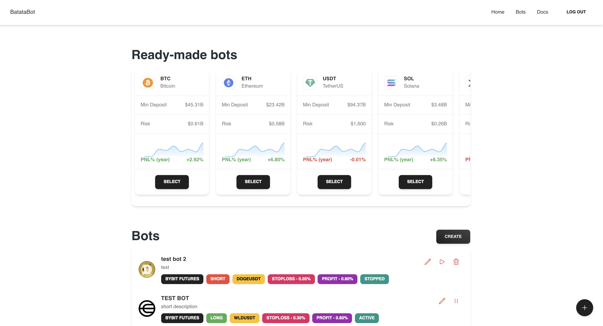

# React Frontend for Crypto Bot

## Overview
This is a React-based frontend application designed for a crypto trading bot. The application is styled using Tailwind CSS and integrates Google Authentication for secure user access.




---

## Features

- **Modern UI:** Built with React and styled using Tailwind CSS for a clean and responsive design.
- **Google Authentication:** Secure login and authentication using Google OAuth.
- **Customizable:** Easily extendable and customizable to fit your specific needs.

---

## Prerequisites

Before you begin, ensure you have met the following requirements:

- Node.js (v16 or higher)
- npm or yarn installed
- Firebase project credentials

---

## Installation

1. Clone the repository:
   ```bash
   git clone https://github.com/your-repo/react-crypto-bot.git
   cd react-crypto-bot
   ```

2. Install dependencies:
   ```bash
   npm install
   # or
   yarn install
   ```

3. Configure environment variables:
   Create a `.env` file in the root directory and add the following:
   ```env
   REACT_APP_FIREBASE_API_KEY=your-firebase-api-key
   REACT_APP_FIREBASE_AUTH_DOMAIN=your-firebase-auth-domain
   REACT_APP_FIREBASE_PROJECT_ID=your-firebase-project-id
   REACT_APP_FIREBASE_STORAGE_BUCKET=your-firebase-storage-bucket
   REACT_APP_FIREBASE_MESSAGING_SENDER_ID=your-firebase-messaging-sender-id
   REACT_APP_FIREBASE_APP_ID=your-firebase-app-id
   ```

4. Start the development server:
   ```bash
   npm start
   # or
   yarn start
   ```

The application will be available at [http://localhost:5173].

---

## Key Dependencies

- [React](https://reactjs.org/)
- [Tailwind CSS](https://tailwindcss.com/)
- [Firebase](https://firebase.google.com/)

---

## Google Authentication Setup

1. Go to the [Firebase Console](https://console.firebase.google.com/).
2. Create a new Firebase project or use an existing one.
3. Enable the "Authentication" feature and configure "Sign-in method" for Google.
4. Add the Firebase configuration details to your `.env` file.

---

## Deployment

1. Build the application:
   ```bash
   npm run build
   # or
   yarn build
   ```

2. Deploy the `build` folder to your preferred hosting provider (e.g., Vercel, Netlify, Firebase Hosting).

---

 
 